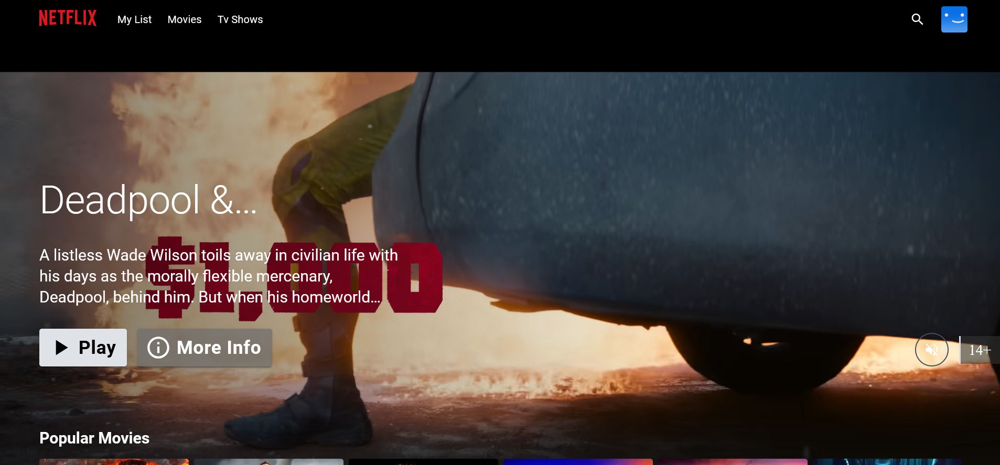

# Netflix Clone - DevSecOps Project
Overview

This project involves deploying a Netflix Clone application on AWS, leveraging DevSecOps practices. The deployment process includes CI/CD integration with Jenkins, containerization with Docker, security scanning with SonarQube, Trivy, OWASP Dependency-Check, and monitoring with Prometheus and Grafana. The final phase includes deployment to a Kubernetes cluster with ArgoCD for continuous delivery.
## Phase 1: Initial Setup and Deployment
### 1.1 Launch EC2 (Ubuntu 22.04)

Provision and launch an EC2 instance on AWS with Ubuntu 22.04.
Connect to the instance via SSH.

### 1.2 Clone the Code

Ensure all packages are updated.
Clone the project repository from GitHub.

### 1.3 Install Docker and Run the App

Install Docker on the EC2 instance.
Build and run the Netflix Clone application as a Docker container.

### 1.4 Get TMDB API Key

 Create an account on TMDB, generate an API key, and use it to rebuild the Docker image.
 Obtain API Key: Create an account on TMDB, navigate to "Settings" > "API", and generate an API key.
 
      docker build --build-arg TMDB_V3_API_KEY=<your-api-key> -t netflix .

## Phase 2: Security
### 2.1 Install SonarQube and Trivy

Set up SonarQube for code quality and security analysis.
Install Trivy and use it to scan Docker images.

### 2.2 Install OWASP Dependency-Check

Download and install OWASP Dependency-Check on the EC2 instance.
Use Dependency-Check to scan project dependencies for known vulnerabilities.

### 2.3 Integrate and Configure SonarQube

Integrate SonarQube with your CI/CD pipeline and configure it for ongoing code analysis.

## Phase 3: CI/CD Setup
### 3.1 Install Jenkins

Install Java and Jenkins on the EC2 instance.
Access Jenkins via the browser and complete the initial setup.

### 3.2 Install Jenkins Plugins

Install necessary Jenkins plugins for Java, Node.js, SonarQube, Docker integration, and OWASP Dependency-Check.

### 3.3 Configure CI/CD Pipeline in Jenkins

Set up a Jenkins pipeline that includes stages for code checkout, SonarQube analysis, dependency installation, OWASP and Trivy scans, Docker build and push, and container deployment.

### 3.4 Jenkins Configuration Adjustments

Add Jenkins user to the Docker group if Docker login fails during the pipeline execution.

## Phase 4: Monitoring
### 4.1 Install Prometheus and Node Exporter

Install Prometheus for monitoring and Node Exporter for system metrics collection.
Access Prometheus via the browser to view metrics.

### 4.2 Install Grafana

Install Grafana on the EC2 instance for data visualization.
Add Prometheus as a data source in Grafana to visualize metrics.

## Phase 5: Notifications
### 5.1 Implement Notification Services

Configure Jenkins to send notifications (e.g., via email) based on pipeline events.

## Phase 6: Kubernetes Deployment
### 6.1 Create Kubernetes Cluster with Node Groups

Set up a Kubernetes cluster with node groups for deploying the application.

### 6.2 Monitor Kubernetes with Prometheus

Deploy Node Exporter in Kubernetes using Helm to monitor the cluster with Prometheus.
Install Node Exporter using Helm:

    helm repo add prometheus-community https://prometheus-community.github.io/helm-charts
    kubectl create namespace prometheus-node-exporter
    helm install prometheus-node-exporter prometheus-community/prometheus-node-exporter --namespace prometheus-node-exporter

### 6.3 Deploy Application with ArgoCD

Implement ArgoCD for continuous delivery to the Kubernetes cluster.
